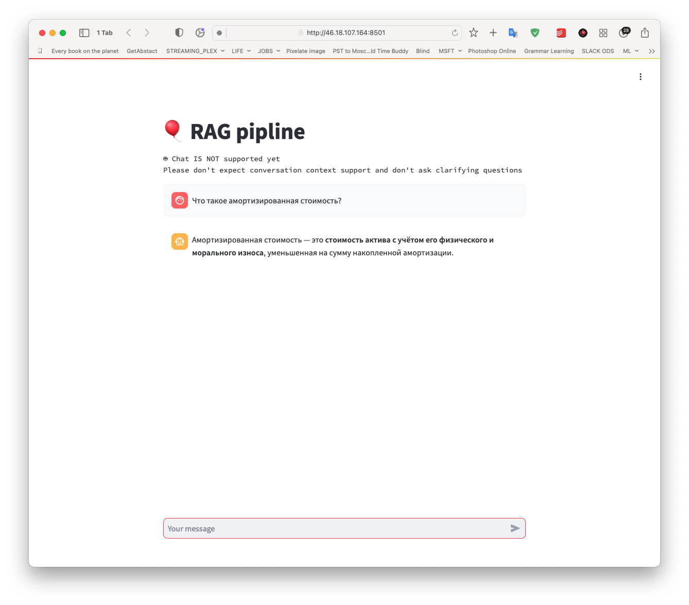

# How to run

```bash
cd rag

docker compose up -d
```

Then go to [http://localhost:8501](http://localhost:8501) and ask your questions:



# Development env setup

```bash
conda create --name rag_hackathon python=3.10
conda activate rag_hackathon
pip install -r requirements.txt
```
